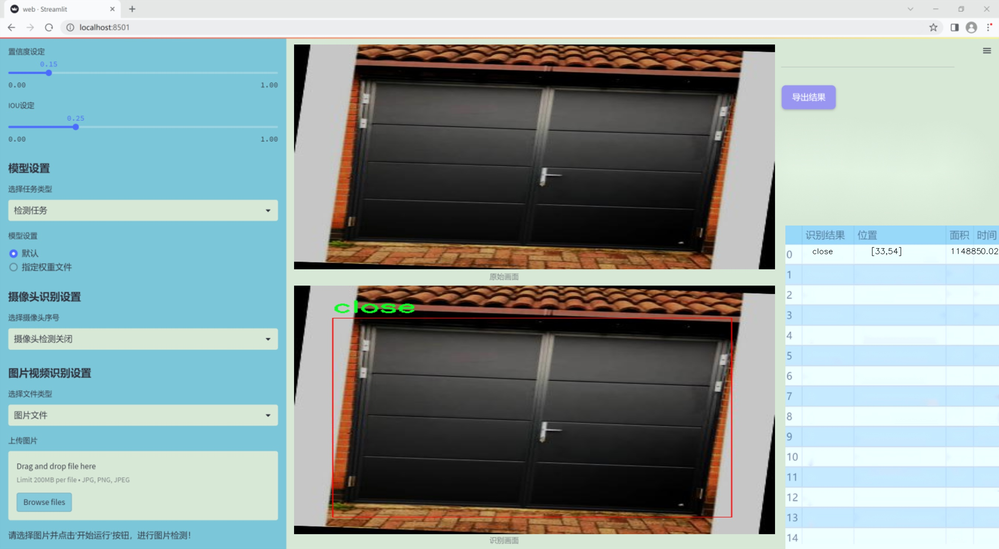

# 改进yolo11-DySnakeConv等200+全套创新点大全：各种门开闭状态检测系统源码＆数据集全套

### 1.图片效果展示




##### 项目来源 **[人工智能促进会 2024.10.24](https://kdocs.cn/l/cszuIiCKVNis)**

注意：由于项目一直在更新迭代，上面“1.图片效果展示”和“2.视频效果展示”展示的系统图片或者视频可能为老版本，新版本在老版本的基础上升级如下：（实际效果以升级的新版本为准）

  （1）适配了YOLOV11的“目标检测”模型和“实例分割”模型，通过加载相应的权重（.pt）文件即可自适应加载模型。

  （2）支持“图片识别”、“视频识别”、“摄像头实时识别”三种识别模式。

  （3）支持“图片识别”、“视频识别”、“摄像头实时识别”三种识别结果保存导出，解决手动导出（容易卡顿出现爆内存）存在的问题，识别完自动保存结果并导出到tempDir中。

  （4）支持Web前端系统中的标题、背景图等自定义修改。

  另外本项目提供训练的数据集和训练教程,暂不提供权重文件（best.pt）,需要您按照教程进行训练后实现图片演示和Web前端界面演示的效果。

### 2.视频效果展示

[2.1 视频效果展示](https://www.bilibili.com/video/BV1zg1YY5Euc/)

### 3.背景

研究背景与意义

随着智能家居和物联网技术的迅速发展，门的开闭状态检测系统在家庭安全、智能管理以及人机交互等领域的应用日益广泛。传统的门状态监测方法多依赖于机械传感器或开关，这些方法不仅成本较高，而且在复杂环境下的可靠性和准确性受到限制。近年来，基于深度学习的计算机视觉技术逐渐成为解决此类问题的有效手段，尤其是目标检测算法的快速发展，为门状态的智能识别提供了新的可能性。

YOLO（You Only Look Once）系列算法因其高效的实时检测能力而受到广泛关注。YOLOv11作为该系列的最新版本，进一步提升了检测精度和速度，适合于各种复杂场景下的目标检测任务。然而，现有的YOLOv11模型在特定应用场景下仍存在一定的局限性，尤其是在门的开闭状态检测方面。针对这一问题，基于改进YOLOv11的门开闭状态检测系统的研究显得尤为重要。

本项目将利用一个包含702张图像的门状态数据集，涵盖“关闭”和“打开”两种状态，进行模型的训练与优化。通过对数据集的深入分析和处理，结合YOLOv11的改进策略，我们期望提升模型在门状态检测中的准确性和鲁棒性。该研究不仅能够为智能家居系统提供可靠的技术支持，还将推动计算机视觉技术在实际应用中的发展，具有重要的理论意义和应用价值。通过实现高效、准确的门状态检测，我们将为用户提供更安全、便捷的智能生活体验，促进智能家居产业的进一步发展。

### 4.数据集信息展示

##### 4.1 本项目数据集详细数据（类别数＆类别名）

nc: 2
names: ['close', 'open']


该项目为【目标检测】数据集，请在【训练教程和Web端加载模型教程（第三步）】这一步的时候按照【目标检测】部分的教程来训练

##### 4.2 本项目数据集信息介绍

本项目数据集信息介绍

本项目所使用的数据集名为“doors”，旨在为改进YOLOv11的各种门开闭状态检测系统提供支持。该数据集专注于门的两种主要状态：关闭（close）和打开（open），通过精确标注和丰富的样本数据，确保模型在实际应用中的准确性和鲁棒性。数据集中包含的类别数量为2，分别对应于门的关闭状态和打开状态，这种简洁的分类设计使得模型能够快速学习并有效区分这两种状态。

“doors”数据集的构建过程经过精心设计，涵盖了多种环境和场景下的门状态，确保了数据的多样性和代表性。样本数据来源于不同类型的门，包括但不限于室内门、外部门以及自动门等，这些样本在不同的光照条件、角度和背景下拍摄，旨在模拟真实世界中可能遇到的各种情况。通过这种方式，数据集不仅增强了模型的泛化能力，还提高了其在复杂环境下的识别精度。

此外，数据集中的每个样本都经过精确标注，确保了训练过程中模型能够准确学习到门的开闭状态。这种高质量的标注不仅有助于提高模型的训练效率，也为后续的验证和测试提供了可靠的基础。通过使用“doors”数据集，研究人员能够更好地优化YOLOv11模型，提升其在门状态检测任务中的表现，进而推动智能监控、智能家居等领域的发展。整体而言，该数据集为门开闭状态检测系统的研究与应用提供了坚实的数据基础和广阔的应用前景。


### 5.全套项目环境部署视频教程（零基础手把手教学）

[5.1 所需软件PyCharm和Anaconda安装教程（第一步）](https://www.bilibili.com/video/BV1BoC1YCEKi/?spm_id_from=333.999.0.0&vd_source=bc9aec86d164b67a7004b996143742dc)


[5.2 安装Python虚拟环境创建和依赖库安装视频教程（第二步）](https://www.bilibili.com/video/BV1ZoC1YCEBw?spm_id_from=333.788.videopod.sections&vd_source=bc9aec86d164b67a7004b996143742dc)

### 6.改进YOLOv11训练教程和Web_UI前端加载模型教程（零基础手把手教学）

[6.1 改进YOLOv11训练教程和Web_UI前端加载模型教程（第三步）](https://www.bilibili.com/video/BV1BoC1YCEhR?spm_id_from=333.788.videopod.sections&vd_source=bc9aec86d164b67a7004b996143742dc)


按照上面的训练视频教程链接加载项目提供的数据集，运行train.py即可开始训练



     Epoch   gpu_mem       box       obj       cls    labels  img_size
     1/200     20.8G   0.01576   0.01955  0.007536        22      1280: 100%|██████████| 849/849 [14:42<00:00,  1.04s/it]
               Class     Images     Labels          P          R     mAP@.5 mAP@.5:.95: 100%|██████████| 213/213 [01:14<00:00,  2.87it/s]
                 all       3395      17314      0.994      0.957      0.0957      0.0843

     Epoch   gpu_mem       box       obj       cls    labels  img_size
     2/200     20.8G   0.01578   0.01923  0.007006        22      1280: 100%|██████████| 849/849 [14:44<00:00,  1.04s/it]
               Class     Images     Labels          P          R     mAP@.5 mAP@.5:.95: 100%|██████████| 213/213 [01:12<00:00,  2.95it/s]
                 all       3395      17314      0.996      0.956      0.0957      0.0845

     Epoch   gpu_mem       box       obj       cls    labels  img_size
     3/200     20.8G   0.01561    0.0191  0.006895        27      1280: 100%|██████████| 849/849 [10:56<00:00,  1.29it/s]
               Class     Images     Labels          P          R     mAP@.5 mAP@.5:.95: 100%|███████   | 187/213 [00:52<00:00,  4.04it/s]
                 all       3395      17314      0.996      0.957      0.0957      0.0845


###### [项目数据集下载链接](https://kdocs.cn/l/cszuIiCKVNis)

### 7.原始YOLOv11算法讲解

YOLOv11是一种由Ultralytics公司开发的最新一代目标检测模型，以其增强的特征提取能力和更高的效率在计算机视觉领域引人注目。该模型在架构上进行了关键升级，通过更新主干和颈部结构，显著提高了对复杂视觉场景的理解和处理精度。YOLOv11不仅在目标检测上表现出色，还支持实例分割、图像分类、姿态估计和定向目标检测（OBB）等任务，展示出其多功能性。

与其前身YOLOv8相比，YOLOv11在设计上实现了深度和宽度的改变，同时引入了几个创新机制。其中，C3k2机制是对YOLOv8中的C2f的改进，提升了浅层特征的处理能力；C2PSA机制则进一步优化了特征图的处理流程。解耦头的创新设计，通过增加两个深度卷积（DWConv），提高了模型对细节的感知能力和分类准确性。

在性能上，YOLOv11m模型在COCO数据集上的平均精度（mAP）提高，并减少了22%的参数量，确保了在运算效率上的突破。该模型可以部署在多种平台上，包括边缘设备、云平台以及支持NVIDIA GPU的系统，彰显出卓越的灵活性和适应性。总体而言，YOLOv11通过一系列的创新突破，对目标检测领域产生了深远的影响，并为未来的开发提供了新的研究方向。


****文档**** ： _ _https://docs.ultralytics.com/models/yolo11/__

****代码链接**** ： _ _https://github.com/ultralytics/ultralytics__

******Performance Metrics******


​ ** **关键特性****

****◆**** ** **增强的特征提取能力**** ：YOLO11采用了改进的主干和颈部架构，增强了 ** **特征提取****
能力，能够实现更精确的目标检测和复杂任务的执行。

****◆**** ** **优化的效率和速度****
：YOLO11引入了精细化的架构设计和优化的训练流程，提供更快的处理速度，并在准确性和性能之间保持最佳平衡。

****◆**** ** **参数更少、精度更高****
：通过模型设计的改进，YOLO11m在COCO数据集上实现了更高的平均精度（mAP），同时使用的参数比YOLOv8m少22%，使其在计算上更加高效，而不牺牲准确性。

****◆**** ** **跨环境的适应性**** ：YOLO11可以无缝部署在各种环境中，包括边缘设备、云平台和支持NVIDIA
GPU的系统，确保最大的灵活性。

****◆**** ** **支持广泛任务****
：无论是目标检测、实例分割、图像分类、姿态估计还是定向目标检测（OBB），YOLO11都旨在应对一系列计算机视觉挑战。

****支持的任务和模式****


​YOLO11建立在YOLOv8中引入的多功能模型范围之上，为各种计算机视觉任务提供增强的支持:


​该表提供了YOLO11模型变体的概述，展示了它们在特定任务中的适用性以及与Inference、Validation、Training和Export等操作模式的兼容性。从实时检测到复杂的分割任务
，这种灵活性使YOLO11适用于计算机视觉的广泛应用。

##### yolov11的创新

■ yolov8 VS yolov11

YOLOv5，YOLOv8和YOLOv11均是ultralytics公司的作品，ultralytics出品必属精品。


​ **具体创新点** ：

**① 深度（depth）和宽度 （width）**

YOLOv8和YOLOv11是基本上完全不同。

**② C3k2机制**

C3k2有参数为c3k，其中在网络的浅层c3k设置为False。C3k2就相当于YOLOv8中的C2f。


​ **③ C2PSA机制**

下图为C2PSA机制的原理图。


​ **④ 解耦头**

解耦头中的分类检测头增加了两个 **DWConv** 。


▲Conv

    
    
    def autopad(k, p=None, d=1):  # kernel, padding, dilation
    
        """Pad to 'same' shape outputs."""
    
        if d > 1:
    
            k = d * (k - 1) + 1 if isinstance(k, int) else [d * (x - 1) + 1 for x in k]  # actual kernel-size
    
        if p is None:
    
            p = k // 2 if isinstance(k, int) else [x // 2 for x in k]  # auto-pad
    
    return p
    
    
    class Conv(nn.Module):
    
        """Standard convolution with args(ch_in, ch_out, kernel, stride, padding, groups, dilation, activation)."""
    
    
        default_act = nn.SiLU()  # default activation
    
    
        def __init__(self, c1, c2, k=1, s=1, p=None, g=1, d=1, act=True):
    
            """Initialize Conv layer with given arguments including activation."""
    
            super().__init__()
    
            self.conv = nn.Conv2d(c1, c2, k, s, autopad(k, p, d), groups=g, dilation=d, bias=False)
    
            self.bn = nn.BatchNorm2d(c2)
    
            self.act = self.default_act if act is True else act if isinstance(act, nn.Module) else nn.Identity()
    
    
        def forward(self, x):
    
            """Apply convolution, batch normalization and activation to input tensor."""
    
            return self.act(self.bn(self.conv(x)))
    
    
        def forward_fuse(self, x):
    
            """Perform transposed convolution of 2D data."""
    
            return self.act(self.conv(x))

▲Conv2d

    
    
    torch.nn.Conv2d(in_channels, out_channels, kernel_size, stride=1, padding=0, dilation=1, groups=1, bias=True, padding_mode='zeros')

▲DWConv

DWConv ** **代表 Depthwise Convolution（深度卷积）****
，是一种在卷积神经网络中常用的高效卷积操作。它主要用于减少计算复杂度和参数量。

    
    
    class DWConv(Conv):
    
        """Depth-wise convolution."""
    
    
        def __init__(self, c1, c2, k=1, s=1, d=1, act=True):  # ch_in, ch_out, kernel, stride, dilation, activation
    
            """Initialize Depth-wise convolution with given parameters."""
    
            super().__init__(c1, c2, k, s, g=math.gcd(c1, c2), d=d, act=act)


### 8.200+种全套改进YOLOV11创新点原理讲解

#### 8.1 200+种全套改进YOLOV11创新点原理讲解大全

由于篇幅限制，每个创新点的具体原理讲解就不全部展开，具体见下列网址中的改进模块对应项目的技术原理博客网址【Blog】（创新点均为模块化搭建，原理适配YOLOv5~YOLOv11等各种版本）

[改进模块技术原理博客【Blog】网址链接](https://gitee.com/qunmasj/good)


#### 8.2 精选部分改进YOLOV11创新点原理讲解

###### 这里节选部分改进创新点展开原理讲解(完整的改进原理见上图和[改进模块技术原理博客链接](https://gitee.com/qunmasj/good)【如果此小节的图加载失败可以通过CSDN或者Github搜索该博客的标题访问原始博客，原始博客图片显示正常】
### 全维动态卷积ODConv
鉴于上述讨论，我们的ODConv引入了一种多维注意机制，该机制具有并行策略，用于学习卷积核在核空间的所有四个维度上的不同注意。图提供了CondConv、DyConv和ODConv的示意性比较。

ODConv的公式：根据等式1中的符号，ODConv可定义为


 将注意力标量分配给整个卷积核。图2示出了将这四种类型的关注乘以n个卷积核的过程。原则上，这四种类型的关注是相互补充的，并且以位置、信道、滤波器和核的顺序将它们逐步乘以卷积核 
 ，使得卷积运算不同w.r.t.所有空间位置、所有输入信道、所有滤波器和输入x的所有核，提供捕获丰富上下文线索的性能保证。因此，ODConv可以显著增强CNN基本卷积运算的特征提取能力。此外，具有单个卷积核的ODConv可以与标准CondConv和DyConv竞争或优于它们，为最终模型引入的额外参数大大减少。提供了大量实验来验证这些优点。通过比较等式1和等式2，我们可以清楚地看到，ODConv是一种更广义的动态卷积。此外，当设置n=1且 所有分量均为1时，只关注滤波器方向 的ODConv将减少为：将基于输入特征的SE变量应用于卷积滤波器，然后进行卷积运算（注意原始SE（Hu等人，2018b）基于输出特征，并且用于重新校准输出特征本身）。这种SE变体是ODConv的特例。


图：将ODConv中的四种注意类型逐步乘以卷积核的示例。（a） 沿空间维度的逐位置乘法运算，（b）沿输入信道维度的逐信道乘法运算、（c）沿输出信道维度的按滤波器乘法运算，以及（d）沿卷积核空间的核维度的按核乘法运算。方法部分对符号进行了说明
实现：对于ODConv，一个关键问题是如何计算卷积核的四种关注度 。继CondConv和DyConv之后，我们还使用SE型注意力模块（Hu等人，2018b），但将多个头部作为来计算它们，其结构如图所示。具体而言，首先通过逐通道全局平均池（GAP）运算将输入压缩到具有长度的特征向量中。随后，存在完全连接（FC）层和四个头部分支。ReLU（Krizhevsky等人，2012）位于FC层之后。FC层将压缩特征向量映射到具有缩减比的低维空间（根据消融实验，我们在所有主要实验中设置 ，避免了高模型复杂度）。对于四个头部分支，每个分支都有一个输出大小如图。

### 引入ODConv的改进YOLO
参考这篇博客涵盖了引入ODConv的改进YOLOv11系统的内容，ODConv采用多维注意机制，在卷积核空间的四个维度上学习不同的注意。结合了CondConv和DyConv的优势，ODConv通过图示的四种注意类型逐步与卷积核相乘，以捕获丰富的上下文线索，提升特征提取能力。

#### ODConv结构与方法
ODConv的公式和图示展示了其关注力分配给卷积核的方式，其中四种类型的关注以位置、信道、滤波器和核的顺序逐步与卷积核相乘。这种结构保证了卷积运算不同于标准的Conv操作，能够捕获更多上下文信息，从而增强了CNN的特征提取能力。另外，单个卷积核的ODConv在性能上能够与CondConv和DyConv相竞争，并且引入的额外参数大幅减少。

ODConv的特殊之处在于其广义的动态卷积性质，同时在特定条件下（n=1且所有分量为1），它可以退化为一种特例，即只关注滤波器方向，这类似于基于输入特征的SE变体，但不同于原始SE，它基于输出特征。

#### ODConv的实现
关键问题在于如何计算卷积核的四种关注度。ODConv采用了SE型注意力模块，结合了多个头部来计算这些关注度。具体实现上，通过逐通道全局平均池运算和完全连接层，将输入压缩为特征向量，随后使用四个头部分支来计算四种不同类型的关注。这样的结构能在保持模型复杂度可控的情况下，提升了特征的表征能力。

ODConv的引入为YOLOv11带来了显著的性能提升，并且通过大量实验证明了其在特征提取方面的优越性。其结合了多维注意机制和卷积操作，为目标检测和分拣系统的提升带来了新的思路和性能突破。


### 9.系统功能展示

图9.1.系统支持检测结果表格显示

  图9.2.系统支持置信度和IOU阈值手动调节

  图9.3.系统支持自定义加载权重文件best.pt(需要你通过步骤5中训练获得)

  图9.4.系统支持摄像头实时识别

  图9.5.系统支持图片识别

  图9.6.系统支持视频识别

  图9.7.系统支持识别结果文件自动保存

  图9.8.系统支持Excel导出检测结果数据


### 10. YOLOv11核心改进源码讲解

#### 10.1 mamba_yolo.py

以下是对给定代码的核心部分进行分析和详细注释的结果。为了简化和突出核心功能，我将保留主要的类和方法，并添加详细的中文注释。

```python
import torch
import math
from functools import partial
from typing import Callable, Any
import torch.nn as nn
from einops import rearrange, repeat
from timm.layers import DropPath

# 定义LayerNorm2d类，继承自nn.Module
class LayerNorm2d(nn.Module):
    def __init__(self, normalized_shape, eps=1e-6, elementwise_affine=True):
        super().__init__()
        # 使用PyTorch的LayerNorm进行二维归一化
        self.norm = nn.LayerNorm(normalized_shape, eps, elementwise_affine)

    def forward(self, x):
        # 调整输入张量的维度以适应LayerNorm
        x = rearrange(x, 'b c h w -> b h w c').contiguous()
        x = self.norm(x)
        x = rearrange(x, 'b h w c -> b c h w').contiguous()
        return x

# Cross Scan操作
class CrossScan(torch.autograd.Function):
    @staticmethod
    def forward(ctx, x: torch.Tensor):
        B, C, H, W = x.shape
        ctx.shape = (B, C, H, W)
        # 创建一个新的张量，包含原始张量及其转置和翻转
        xs = x.new_empty((B, 4, C, H * W))
        xs[:, 0] = x.flatten(2, 3)  # 原始张量展平
        xs[:, 1] = x.transpose(dim0=2, dim1=3).flatten(2, 3)  # 转置并展平
        xs[:, 2:4] = torch.flip(xs[:, 0:2], dims=[-1])  # 翻转
        return xs

    @staticmethod
    def backward(ctx, ys: torch.Tensor):
        B, C, H, W = ctx.shape
        L = H * W
        # 反向传播计算
        ys = ys[:, 0:2] + ys[:, 2:4].flip(dims=[-1]).view(B, 2, -1, L)
        y = ys[:, 0] + ys[:, 1].view(B, -1, W, H).transpose(dim0=2, dim1=3).contiguous().view(B, -1, L)
        return y.view(B, -1, H, W)

# Selective Scan核心操作
class SelectiveScanCore(torch.autograd.Function):
    @staticmethod
    @torch.cuda.amp.custom_fwd
    def forward(ctx, u, delta, A, B, C, D=None, delta_bias=None, delta_softplus=False, nrows=1, backnrows=1,
                oflex=True):
        # 确保输入张量是连续的
        if u.stride(-1) != 1:
            u = u.contiguous()
        if delta.stride(-1) != 1:
            delta = delta.contiguous()
        if D is not None and D.stride(-1) != 1:
            D = D.contiguous()
        if B.stride(-1) != 1:
            B = B.contiguous()
        if C.stride(-1) != 1:
            C = C.contiguous()
        if B.dim() == 3:
            B = B.unsqueeze(dim=1)
            ctx.squeeze_B = True
        if C.dim() == 3:
            C = C.unsqueeze(dim=1)
            ctx.squeeze_C = True
        ctx.delta_softplus = delta_softplus
        ctx.backnrows = backnrows
        # 调用CUDA核心函数进行前向计算
        out, x, *rest = selective_scan_cuda_core.fwd(u, delta, A, B, C, D, delta_bias, delta_softplus, 1)
        ctx.save_for_backward(u, delta, A, B, C, D, delta_bias, x)
        return out

    @staticmethod
    @torch.cuda.amp.custom_bwd
    def backward(ctx, dout, *args):
        u, delta, A, B, C, D, delta_bias, x = ctx.saved_tensors
        if dout.stride(-1) != 1:
            dout = dout.contiguous()
        # 调用CUDA核心函数进行反向计算
        du, ddelta, dA, dB, dC, dD, ddelta_bias, *rest = selective_scan_cuda_core.bwd(
            u, delta, A, B, C, D, delta_bias, dout, x, ctx.delta_softplus, 1
        )
        return (du, ddelta, dA, dB, dC, dD, ddelta_bias, None, None, None, None)

# 定义SS2D类，使用选择性扫描
class SS2D(nn.Module):
    def __init__(self, d_model=96, d_state=16, ssm_ratio=2.0, ssm_rank_ratio=2.0, dt_rank="auto", act_layer=nn.SiLU, dropout=0.0, bias=False):
        super().__init__()
        # 初始化模型参数
        self.d_model = d_model
        self.d_state = d_state
        self.ssm_ratio = ssm_ratio
        self.ssm_rank_ratio = ssm_rank_ratio
        self.dt_rank = dt_rank
        self.act = act_layer()
        self.dropout = nn.Dropout(dropout) if dropout > 0. else nn.Identity()
        # 输入投影层
        self.in_proj = nn.Conv2d(d_model, int(ssm_ratio * d_model), kernel_size=1, bias=bias)
        # 输出投影层
        self.out_proj = nn.Conv2d(int(ssm_ratio * d_model), d_model, kernel_size=1, bias=bias)

    def forward(self, x: torch.Tensor):
        # 前向传播
        x = self.in_proj(x)
        x = self.act(x)
        x = self.dropout(x)
        x = self.out_proj(x)
        return x

# 定义VSSBlock_YOLO类，结合选择性扫描和其他操作
class VSSBlock_YOLO(nn.Module):
    def __init__(self, in_channels: int = 0, hidden_dim: int = 0, drop_path: float = 0, norm_layer: Callable[..., torch.nn.Module] = partial(LayerNorm2d, eps=1e-6)):
        super().__init__()
        self.proj_conv = nn.Sequential(
            nn.Conv2d(in_channels, hidden_dim, kernel_size=1, stride=1, padding=0, bias=True),
            nn.BatchNorm2d(hidden_dim),
            nn.SiLU()
        )
        self.ss2d = SS2D(d_model=hidden_dim)  # 使用SS2D模块
        self.drop_path = DropPath(drop_path)

    def forward(self, input: torch.Tensor):
        input = self.proj_conv(input)  # 投影
        x = self.drop_path(self.ss2d(input))  # 选择性扫描
        return x

# 定义SimpleStem类，作为模型的初始层
class SimpleStem(nn.Module):
    def __init__(self, inp, embed_dim, ks=3):
        super().__init__()
        self.conv = nn.Sequential(
            nn.Conv2d(inp, embed_dim // 2, kernel_size=ks, stride=2, padding=autopad(ks, d=1), bias=False),
            nn.BatchNorm2d(embed_dim // 2),
            nn.GELU(),
            nn.Conv2d(embed_dim // 2, embed_dim, kernel_size=ks, stride=2, padding=autopad(ks, d=1), bias=False),
            nn.BatchNorm2d(embed_dim),
            nn.SiLU(),
        )

    def forward(self, x):
        return self.conv(x)  # 前向传播

# 定义VisionClueMerge类，合并特征
class VisionClueMerge(nn.Module):
    def __init__(self, dim, out_dim):
        super().__init__()
        self.pw_linear = nn.Sequential(
            nn.Conv2d(dim * 4, out_dim, kernel_size=1, stride=1, padding=0),
            nn.BatchNorm2d(out_dim),
            nn.SiLU()
        )

    def forward(self, x):
        # 合并特征
        y = torch.cat([
            x[..., ::2, ::2],
            x[..., 1::2, ::2],
            x[..., ::2, 1::2],
            x[..., 1::2, 1::2]
        ], dim=1)
        return self.pw_linear(y)  # 前向传播
```

### 代码核心部分总结：
1. **LayerNorm2d**: 实现了二维的Layer Normalization。
2. **CrossScan**: 实现了交叉扫描的前向和反向传播操作。
3. **SelectiveScanCore**: 实现了选择性扫描的核心操作，包括前向和反向传播。
4. **SS2D**: 结合选择性扫描的模块，包含输入和输出投影。
5. **VSSBlock_YOLO**: 结合了选择性扫描和投影的块，作为YOLO模型的一部分。
6. **SimpleStem**: 模型的初始层，负责特征提取。
7. **VisionClueMerge**: 特征合并模块，处理不同分辨率的特征。

以上代码展示了深度学习模型中常用的操作和模块，特别是在计算机视觉任务中的应用。

这个程序文件 `mamba_yolo.py` 是一个用于实现 YOLO（You Only Look Once）目标检测模型的深度学习框架。它使用了 PyTorch 库，并结合了一些高级的深度学习技术，如选择性扫描（Selective Scan）和不同的模块化设计，以提高模型的性能和灵活性。

文件的开头部分导入了必要的库，包括 PyTorch、数学库、以及一些用于深度学习的工具。接着，定义了一些辅助类和函数，例如 `LayerNorm2d` 类用于实现二维层归一化，`autopad` 函数用于自动计算卷积的填充。

接下来，文件中定义了多个重要的类和函数，这些类和函数构成了 YOLO 模型的核心部分。`CrossScan` 和 `CrossMerge` 类实现了交叉扫描和合并操作，分别用于处理输入张量的不同维度和结构。`SelectiveScanCore` 类则实现了选择性扫描的前向和反向传播逻辑，允许模型在计算时选择性地处理数据，以提高效率。

`SS2D` 类是一个重要的模块，负责实现深度学习中的状态空间模型（State Space Model）。它的构造函数中定义了多个参数，包括模型的维度、状态维度、卷积层的设置等。`forward` 方法则实现了模型的前向传播逻辑。

在文件中，还定义了 `RGBlock` 和 `LSBlock` 类，这些是构建模型的基本模块，分别实现了不同的卷积和激活操作。`XSSBlock` 和 `VSSBlock_YOLO` 类则是更高层次的模块，整合了之前定义的模块，形成更复杂的网络结构。

`SimpleStem` 类用于实现模型的初始卷积层，负责将输入图像转换为特征图。`VisionClueMerge` 类则用于在不同层之间合并特征，以便于模型在处理多尺度特征时能够更好地融合信息。

整个文件的设计体现了深度学习模型构建中的模块化思想，通过将不同的功能模块化，便于后续的维护和扩展。模型的每个部分都可以独立进行调整和优化，从而提升整体性能。通过使用选择性扫描等技术，模型能够在计算效率和准确性之间取得更好的平衡。

#### 10.2 afpn.py

以下是经过简化和注释的核心代码部分，主要包括基本模块、上采样、下采样、ASFF（自适应特征融合模块）以及AFPN（自适应特征金字塔网络）结构。

```python
import torch
import torch.nn as nn
import torch.nn.functional as F
from ..modules.conv import Conv

# 基本卷积块，包含两个卷积层和残差连接
class BasicBlock(nn.Module):
    def __init__(self, filter_in, filter_out):
        super(BasicBlock, self).__init__()
        self.conv1 = Conv(filter_in, filter_out, 3)  # 第一个卷积层
        self.conv2 = Conv(filter_out, filter_out, 3, act=False)  # 第二个卷积层，不使用激活函数

    def forward(self, x):
        residual = x  # 保存输入以进行残差连接
        out = self.conv1(x)  # 通过第一个卷积层
        out = self.conv2(out)  # 通过第二个卷积层
        out += residual  # 添加残差
        return self.conv1.act(out)  # 返回激活后的输出

# 上采样模块
class Upsample(nn.Module):
    def __init__(self, in_channels, out_channels, scale_factor=2):
        super(Upsample, self).__init__()
        self.upsample = nn.Sequential(
            Conv(in_channels, out_channels, 1),  # 1x1卷积
            nn.Upsample(scale_factor=scale_factor, mode='bilinear')  # 双线性插值上采样
        )

    def forward(self, x):
        return self.upsample(x)  # 前向传播

# 下采样模块，支持不同的下采样因子
class Downsample(nn.Module):
    def __init__(self, in_channels, out_channels, scale_factor):
        super(Downsample, self).__init__()
        self.downsample = Conv(in_channels, out_channels, scale_factor, scale_factor, 0)  # 使用卷积进行下采样

    def forward(self, x):
        return self.downsample(x)  # 前向传播

# 自适应特征融合模块（ASFF），用于融合不同尺度的特征
class ASFF(nn.Module):
    def __init__(self, num_levels, inter_dim=512):
        super(ASFF, self).__init__()
        self.inter_dim = inter_dim
        compress_c = 8  # 压缩通道数

        # 为每个输入特征图生成权重
        self.weight_levels = nn.ModuleList([Conv(inter_dim, compress_c, 1) for _ in range(num_levels)])
        self.weight_levels_combined = nn.Conv2d(compress_c * num_levels, num_levels, kernel_size=1)  # 合并权重
        self.conv = Conv(inter_dim, inter_dim, 3)  # 最后的卷积层

    def forward(self, *inputs):
        # 计算每个输入的权重
        weights = [weight(input) for weight, input in zip(self.weight_levels, inputs)]
        levels_weight_v = torch.cat(weights, dim=1)  # 拼接权重
        levels_weight = self.weight_levels_combined(levels_weight_v)  # 合并权重
        levels_weight = F.softmax(levels_weight, dim=1)  # 归一化权重

        # 根据权重融合输入特征
        fused_out_reduced = sum(input * levels_weight[:, i:i+1, :, :] for i, input in enumerate(inputs))
        return self.conv(fused_out_reduced)  # 返回融合后的特征

# 自适应特征金字塔网络（AFPN）
class AFPN(nn.Module):
    def __init__(self, in_channels, out_channels, factor=4):
        super(AFPN, self).__init__()
        # 初始化卷积层
        self.convs = nn.ModuleList([Conv(in_channel, in_channel // factor, 1) for in_channel in in_channels])
        self.body = BlockBody_P345([in_channel // factor for in_channel in in_channels])  # 特征处理体
        self.final_convs = nn.ModuleList([Conv(in_channel // factor, out_channels, 1) for in_channel in in_channels])  # 输出卷积层

    def forward(self, x):
        # 对输入特征进行卷积处理
        processed_inputs = [conv(input) for conv, input in zip(self.convs, x)]
        outputs = self.body(processed_inputs)  # 通过特征处理体
        # 最后输出
        return [final_conv(output) for final_conv, output in zip(self.final_convs, outputs)]
```

### 代码说明：
1. **BasicBlock**：实现了一个基本的卷积块，包含两个卷积层和残差连接。
2. **Upsample/Downsample**：实现了上采样和下采样模块，分别用于特征图的尺寸调整。
3. **ASFF**：自适应特征融合模块，通过计算不同尺度特征的权重来融合特征。
4. **AFPN**：自适应特征金字塔网络，整合多个尺度的特征并输出最终结果。

该代码结构清晰，模块化设计便于扩展和维护。

这个程序文件 `afpn.py` 实现了一个基于深度学习的特征金字塔网络（FPN），主要用于图像处理任务，如目标检测和分割。代码中定义了多个类，每个类实现了特定的功能，下面对主要部分进行逐一说明。

首先，程序导入了一些必要的库，包括 `torch` 和 `torch.nn`，并从其他模块导入了一些自定义的卷积和块结构。`OrderedDict` 用于有序字典的创建，但在这个代码中并未使用。

接下来，定义了一个 `BasicBlock` 类，它是一个基本的卷积块，包含两个卷积层和一个残差连接。这个块的设计遵循了残差网络的理念，允许信息在网络中更有效地传递。

然后，定义了一系列上采样和下采样的类，如 `Upsample`、`Downsample_x2`、`Downsample_x4` 和 `Downsample_x8`，这些类用于在不同的尺度上调整特征图的大小，以便在特征金字塔中进行融合。

接下来是自适应特征融合模块（ASFF），包括 `ASFF_2`、`ASFF_3` 和 `ASFF_4`。这些模块的作用是根据输入特征图的权重动态融合不同尺度的特征图。每个 ASFF 模块都使用了卷积层来计算权重，并通过 softmax 函数归一化这些权重，以便在融合时对不同特征图进行加权。

`BlockBody_P345` 和 `BlockBody_P2345` 类分别实现了不同层次的特征处理结构。它们通过多个卷积块和 ASFF 模块来处理输入的特征图，进行特征提取和融合。这些类的设计使得网络能够在多个尺度上有效地学习特征。

`AFPN_P345` 和 `AFPN_P2345` 类是整个网络的核心，负责将输入特征图传递到各个处理模块，并输出融合后的特征图。这些类在初始化时定义了输入和输出通道的数量，并通过调用之前定义的块体类来构建网络结构。

最后，`AFPN_P345_Custom` 和 `AFPN_P2345_Custom` 类允许用户自定义块类型，使得网络的灵活性更高，用户可以根据需要选择不同的卷积块。

总体来说，这个程序文件实现了一个灵活且强大的特征金字塔网络结构，适用于多种计算机视觉任务。通过使用残差连接、动态特征融合和多尺度处理，网络能够更好地捕捉图像中的重要信息，提高了模型的性能。

#### 10.3 kan_conv.py

以下是经过简化和注释的核心代码部分：

```python
import torch
import torch.nn as nn

class KANConvNDLayer(nn.Module):
    def __init__(self, conv_class, norm_class, input_dim, output_dim, spline_order, kernel_size,
                 groups=1, padding=0, stride=1, dilation=1,
                 ndim: int = 2, grid_size=5, base_activation=nn.GELU, grid_range=[-1, 1], dropout=0.0):
        super(KANConvNDLayer, self).__init__()
        
        # 初始化参数
        self.inputdim = input_dim  # 输入维度
        self.outdim = output_dim    # 输出维度
        self.spline_order = spline_order  # 样条阶数
        self.kernel_size = kernel_size  # 卷积核大小
        self.padding = padding  # 填充
        self.stride = stride  # 步幅
        self.dilation = dilation  # 膨胀
        self.groups = groups  # 分组数
        self.ndim = ndim  # 维度
        self.grid_size = grid_size  # 网格大小
        self.base_activation = base_activation()  # 基础激活函数
        self.grid_range = grid_range  # 网格范围

        # 初始化dropout层
        self.dropout = nn.Dropout2d(p=dropout) if ndim == 2 else nn.Dropout3d(p=dropout) if ndim == 3 else nn.Dropout1d(p=dropout) if ndim == 1 else None
        
        # 检查分组数和维度
        if groups <= 0 or input_dim % groups != 0 or output_dim % groups != 0:
            raise ValueError('groups must be a positive integer and input/output dimensions must be divisible by groups')

        # 创建基础卷积层
        self.base_conv = nn.ModuleList([conv_class(input_dim // groups, output_dim // groups, kernel_size, stride, padding, dilation, groups=1, bias=False) for _ in range(groups)])

        # 创建样条卷积层
        self.spline_conv = nn.ModuleList([conv_class((grid_size + spline_order) * input_dim // groups, output_dim // groups, kernel_size, stride, padding, dilation, groups=1, bias=False) for _ in range(groups)])

        # 创建归一化层
        self.layer_norm = nn.ModuleList([norm_class(output_dim // groups) for _ in range(groups)])

        # 创建PReLU激活层
        self.prelus = nn.ModuleList([nn.PReLU() for _ in range(groups)])

        # 生成网格
        h = (self.grid_range[1] - self.grid_range[0]) / grid_size
        self.grid = torch.linspace(self.grid_range[0] - h * spline_order, self.grid_range[1] + h * spline_order, grid_size + 2 * spline_order + 1, dtype=torch.float32)

        # 初始化卷积层权重
        for conv_layer in self.base_conv:
            nn.init.kaiming_uniform_(conv_layer.weight, nonlinearity='linear')
        for conv_layer in self.spline_conv:
            nn.init.kaiming_uniform_(conv_layer.weight, nonlinearity='linear')

    def forward_kan(self, x, group_index):
        # 基础卷积输出
        base_output = self.base_conv[group_index](self.base_activation(x))

        # 计算样条基
        x_uns = x.unsqueeze(-1)  # 扩展维度
        target = x.shape[1:] + self.grid.shape
        grid = self.grid.view(*([1] * (self.ndim + 1) + [-1])).expand(target).contiguous().to(x.device)

        # 计算样条基
        bases = ((x_uns >= grid[..., :-1]) & (x_uns < grid[..., 1:])).to(x.dtype)
        for k in range(1, self.spline_order + 1):
            left_intervals = grid[..., :-(k + 1)]
            right_intervals = grid[..., k:-1]
            delta = torch.where(right_intervals == left_intervals, torch.ones_like(right_intervals), right_intervals - left_intervals)
            bases = ((x_uns - left_intervals) / delta * bases[..., :-1]) + ((grid[..., k + 1:] - x_uns) / (grid[..., k + 1:] - grid[..., 1:(-k)]) * bases[..., 1:])
        
        bases = bases.contiguous().moveaxis(-1, 2).flatten(1, 2)  # 处理样条基
        spline_output = self.spline_conv[group_index](bases)  # 样条卷积输出
        x = self.prelus[group_index](self.layer_norm[group_index](base_output + spline_output))  # 激活和归一化

        if self.dropout is not None:
            x = self.dropout(x)  # 应用dropout

        return x

    def forward(self, x):
        split_x = torch.split(x, self.inputdim // self.groups, dim=1)  # 按组分割输入
        output = []
        for group_ind, _x in enumerate(split_x):
            y = self.forward_kan(_x.clone(), group_ind)  # 对每个组应用forward_kan
            output.append(y.clone())
        y = torch.cat(output, dim=1)  # 合并输出
        return y
```

### 代码说明：
1. **初始化方法**：设置卷积层、归一化层、激活函数等，并检查输入参数的有效性。
2. **`forward_kan` 方法**：处理输入数据，计算基础卷积和样条卷积的输出，并应用激活和归一化。
3. **`forward` 方法**：将输入数据按组分割，分别处理每个组的输入，并将结果合并。

这个程序文件 `kan_conv.py` 定义了一个名为 `KANConvNDLayer` 的神经网络层，旨在实现一种新的卷积操作，结合了基于样条（spline）的变换和标准卷积。程序中还定义了三个特定维度的卷积层类：`KANConv1DLayer`、`KANConv2DLayer` 和 `KANConv3DLayer`，它们分别用于一维、二维和三维卷积。

在 `KANConvNDLayer` 类的构造函数中，初始化了一些重要的参数，包括输入和输出维度、卷积核大小、样条的阶数、分组数、填充、步幅、扩张、网格大小、基础激活函数、网格范围和 dropout 概率。构造函数中首先检查了分组数和输入输出维度的有效性，然后创建了基础卷积层、样条卷积层、层归一化层和 PReLU 激活层的模块列表。

接下来，程序生成了一个网格，用于样条计算。网格的范围和大小由用户指定，样条基函数的计算在 `forward_kan` 方法中实现。该方法首先对输入进行基础激活，然后通过基础卷积层进行线性变换。接着，计算样条基函数并通过样条卷积层进行变换，最后应用层归一化和 PReLU 激活函数。

`forward` 方法将输入数据按组进行分割，并对每个组调用 `forward_kan` 方法进行处理，最后将所有组的输出拼接在一起返回。

`KANConv3DLayer`、`KANConv2DLayer` 和 `KANConv1DLayer` 类分别继承自 `KANConvNDLayer`，并在构造函数中指定相应的卷积和归一化类，以便于实现不同维度的卷积操作。

整体而言，这个文件实现了一种灵活且强大的卷积层，能够处理多维数据，并结合了样条变换的优点，适用于需要高效特征提取的深度学习任务。

#### 10.4 prepbn.py

以下是经过简化和注释的核心代码部分：

```python
import torch
import torch.nn as nn

# 定义一个自定义的批量归一化类
class RepBN(nn.Module):
    def __init__(self, channels):
        super(RepBN, self).__init__()
        # alpha是一个可学习的参数，初始化为1
        self.alpha = nn.Parameter(torch.ones(1))
        # 使用1维的批量归一化
        self.bn = nn.BatchNorm1d(channels)

    def forward(self, x):
        # 将输入张量的维度进行转置，方便批量归一化处理
        x = x.transpose(1, 2)
        # 进行批量归一化，并加上alpha乘以输入x
        x = self.bn(x) + self.alpha * x
        # 再次转置回原来的维度
        x = x.transpose(1, 2)
        return x

# 定义一个线性归一化类
class LinearNorm(nn.Module):
    def __init__(self, dim, norm1, norm2, warm=0, step=300000, r0=1.0):
        super(LinearNorm, self).__init__()
        # 预热步数
        self.register_buffer('warm', torch.tensor(warm))
        # 当前迭代步数
        self.register_buffer('iter', torch.tensor(step))
        # 总步数
        self.register_buffer('total_step', torch.tensor(step))
        self.r0 = r0  # 初始比例
        # norm1和norm2是两个归一化函数
        self.norm1 = norm1(dim)
        self.norm2 = norm2(dim)

    def forward(self, x):
        if self.training:  # 如果在训练模式
            if self.warm > 0:  # 如果还有预热步数
                self.warm.copy_(self.warm - 1)  # 减少预热步数
                x = self.norm1(x)  # 进行norm1归一化
            else:
                # 计算当前的lambda值
                lamda = self.r0 * self.iter / self.total_step
                if self.iter > 0:
                    self.iter.copy_(self.iter - 1)  # 减少迭代步数
                x1 = self.norm1(x)  # 进行norm1归一化
                x2 = self.norm2(x)  # 进行norm2归一化
                # 根据lambda值加权合并两个归一化结果
                x = lamda * x1 + (1 - lamda) * x2
        else:
            # 如果不是训练模式，直接使用norm2归一化
            x = self.norm2(x)
        return x
```

### 代码注释说明：
1. **RepBN类**：
   - 该类实现了一个自定义的批量归一化模块，包含一个可学习的参数`alpha`，用于调整归一化后的输出。
   - 在`forward`方法中，输入张量的维度被转置，以适应`BatchNorm1d`的要求，经过归一化后再加上`alpha`乘以输入，最后转置回原来的维度。

2. **LinearNorm类**：
   - 该类实现了一个线性归一化模块，支持两种归一化方法（`norm1`和`norm2`），并根据训练状态和预热步数动态调整归一化的方式。
   - 在训练模式下，首先检查是否处于预热阶段，如果是，则只使用`norm1`进行归一化；如果预热结束，则根据当前迭代步数计算一个权重`lambda`，并将`norm1`和`norm2`的结果加权合并。
   - 在非训练模式下，直接使用`norm2`进行归一化。

这个程序文件定义了两个神经网络模块，分别是 `RepBN` 和 `LinearNorm`，它们都是基于 PyTorch 框架构建的。

`RepBN` 类是一个自定义的批量归一化（Batch Normalization）模块。它的构造函数接收一个参数 `channels`，表示输入数据的通道数。在初始化过程中，它定义了一个可学习的参数 `alpha`，并创建了一个标准的批量归一化层 `bn`。在 `forward` 方法中，输入张量 `x` 首先进行维度转换，将通道维度与时间维度交换（因为 `BatchNorm1d` 期望的输入格式是 [batch_size, channels, length]）。接着，输入通过批量归一化层进行处理，并与 `alpha` 乘以原始输入相加。最后，再次进行维度转换以恢复原来的形状，并返回处理后的结果。

`LinearNorm` 类则实现了一种线性归一化策略。它的构造函数接收多个参数，包括 `dim`（输入的维度）、`norm1` 和 `norm2`（分别是两种归一化方法的类），以及一些控制训练过程的参数如 `warm` 和 `step`。在初始化时，使用 `register_buffer` 方法注册了一些张量，用于在训练过程中跟踪状态。`r0` 是一个初始的比例因子。在 `forward` 方法中，如果模型处于训练状态，首先检查是否还有预热步骤（`warm`）。如果有，执行第一种归一化方法 `norm1`。一旦预热结束，计算一个动态的比例因子 `lamda`，并根据当前的迭代次数来调整这个比例。然后，分别使用 `norm1` 和 `norm2` 对输入进行归一化，并根据 `lamda` 将两者加权组合。如果模型不在训练状态，则直接使用第二种归一化方法 `norm2` 处理输入。

总体而言，这个文件实现了两种不同的归一化策略，分别适用于不同的训练阶段和需求，提供了灵活的归一化处理方式，以便在深度学习模型中使用。

注意：由于此博客编辑较早，上面“10.YOLOv11核心改进源码讲解”中部分代码可能会优化升级，仅供参考学习，以“11.完整训练+Web前端界面+200+种全套创新点源码、数据集获取”的内容为准。

### 11.完整训练+Web前端界面+200+种全套创新点源码、数据集获取


# [下载链接：https://mbd.pub/o/bread/Zp6WmZdt](https://mbd.pub/o/bread/Zp6WmZdt)